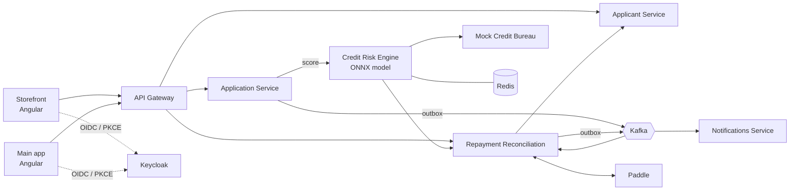

# BridgePay

[](https://github.com/davidsoldat/bridgepay/actions/workflows/ci.yml)

An instant-credit / Buy-Now-Pay-Later underwriting platform, similar in shape to Klarna or Afterpay. A shopper splits a purchase into four installments at checkout, a trained credit-risk model decides in real time whether to extend credit, the merchant is paid in full immediately, and the platform collects the installments afterward — carrying the default risk itself.

Built as independently deployable Spring Boot microservices with Kafka, a from-scratch trained ML model served via ONNX Runtime, Keycloak auth, and two Angular frontends.

## Architecture



| Component | What it does |
|---|---|
| **Landing** | Public home page: what BridgePay is, a guided demo with the demo logins, and the architecture |
| **API Gateway** | Spring Cloud Gateway: path routing, JWT validation, rate limiting, correlation IDs |
| **Applicant Service** | Shopper signup and identity profile. No Kafka, by design |
| **Application Service** | Checkout flow, decision finalization, ops review, merchant sales/payouts. Publishes decisions through a transactional outbox |
| **Credit Risk Engine** | Scores applications with a logistic-regression model (ONNX), plus a policy overlay for on-platform repayment history. Fails safe to manual review |
| **Mock Credit Bureau** | Stands in for a real bureau: deterministically maps each applicant to a held-out row of the Kaggle *Give Me Some Credit* dataset |
| **Repayment Reconciliation** | Creates installment plans in Paddle, verifies Paddle webhooks, tracks repayments. Failed events land in an ops retry queue |
| **Notifications Service** | Idempotent Kafka consumer for decision and repayment events |
| **Storefront** | Demo merchant shop with the embedded "Pay in 4" checkout and a shopper account page |
| **Main app** | Role-gated ops dashboard (review queue, score explanations, failed events) and merchant dashboard (sales, payouts) |

Every external call (bureau, repayment history, Paddle, applicant lookup) sits behind its own circuit breaker. Any scoring failure routes the application to manual review rather than approving or declining blind.

## Tech stack

Java 21 · Spring Boot 4 · Spring Cloud Gateway · PostgreSQL (schema per service, Flyway) · Kafka (KRaft) · Redis · Keycloak · ONNX Runtime · scikit-learn · Angular 21 (standalone components, signals) · Tailwind · Testcontainers · Docker · GitHub Actions → GHCR (linux/arm64) · k3s

## The model

`services/credit-risk-engine/scripts/train_model.py` trains a `StandardScaler` + `LogisticRegression` on 10 bureau-style features from the Kaggle dataset, excluding the exact rows the mock bureau serves, and exports to ONNX. Eval AUC-ROC is 0.82. Each decision stores per-feature log-odds contributions, which the ops review screen renders as an explanation chart.

## Run it locally

Requires Docker.

```bash
docker compose up --build
```

| URL | What |
|---|---|
| http://localhost:4202 | Start here: landing page with the demo guide |
| http://localhost:4201 | Storefront (shopper) |
| http://localhost:4200 | Main app (ops / merchant) |
| http://localhost:8086 | API gateway |
| http://localhost:8180 | Keycloak admin (`admin` / `admin`) |

Demo users (password = username): `shopper1`, `ops1`, `merchant1`.

A full loop: check out as `shopper1` in the storefront → review and approve as `ops1` in the main app → see the sale and payout as `merchant1`.

Each service also has its own `docker-compose.yml` and README for working on it alone. Build and test one service with `cd services/<name> && mvn clean verify`.

## Repository layout

```
services/        7 Spring Boot services, one Maven project each
frontend/        main-app and storefront (Angular)
infrastructure/  Keycloak realm + login theme, Postgres init, Kubernetes manifests
docs/            platform spec: architecture, schemas, Kafka and API contracts, ML plan
data/            training data location (dataset not committed)
```

The full design is in [`docs/bridgepay-platform-spec.md`](docs/bridgepay-platform-spec.md).

## Status and limitations

- **Deployment:** Kubernetes manifests (Kustomize, k3s) are in [`infrastructure/k8s`](infrastructure/k8s) and run end to end on a local k3d cluster. The production overlay for the ARM64 OCI instance comes once that host exists. CI already builds and publishes arm64 images.
- **Paddle** runs against the sandbox API shape. Without real sandbox keys, repayment-plan creation fails into the ops failed-events queue.
- **The credit bureau is a simulation.** Making real credit decisions would need a real bureau integration, KYC, and lending compliance. That is a regulated undertaking, not an engineering task.
